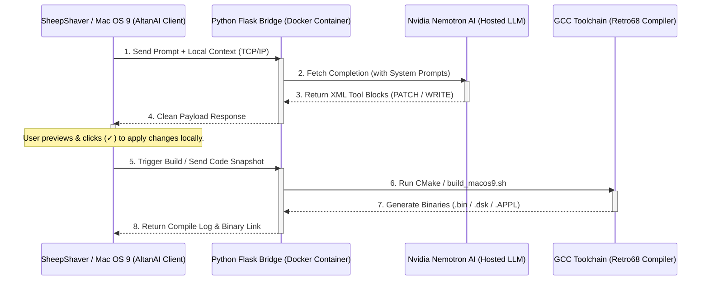

# AltanAI: Classic Mac OS 9 AI Code Studio & Co-pilot

AltanAI is a native, native-compiled Classic Mac OS 9 coding co-pilot and IDE. It allows you to write, modify, refactor, and build Mac OS 9 applications directly from a vintage Macintosh environment using modern Large Language Models (LLMs) and containerized Retro68 compiler chains.

---

## Visual Tour

### 1. Main Chat Interface
A Generic IM-style chat interface displaying server response logs.


### 2. File Menu Commands
A Classic drop-down menu managing connection settings, remote compile triggers, project builders, and direct shortcuts to apply/reject AI code changes.


### 3. Local File Manager
Scans local virtual disk folders and tracks files using the Macintosh File Manager.


### 4. Text Editor Tab Views
Multi-tab text editor with line numbers, search tools, and dirty flags.


### 5. Dialog Panels
Modal settings, history managers, and product details panels.


### 6. Busy State event blocking
Watch cursor loading indicators and event blocks.


### 7. Interactive AI Code Application
Green checkmark (✓) prompt change verification indicators.


---

## Architecture and System Flow

The project is split into two primary components:
1. **The Classic Client (AltanAI):** A C-based application written for the Classic Macintosh Toolbox. It runs natively inside Mac OS 9 (or emulators like SheepShaver) and communicates over Open Transport TCP/IP sockets.
2. **The Compile & AI Bridge (Backend):** A lightweight Python-based Flask service running in a Docker container on the host macOS or a remote server. It coordinates prompt completions with high-capacity LLMs (e.g., Nvidia Nemotron) and manages the Retro68 gcc-cross-compilation pipeline.



---

## Design Choices & Legacy Limitations

Creating a modern developer tool for a 25-year-old operating system required addressing major platform constraints:

### 1. The 32KB TextEdit Buffer Boundary
In Classic Mac OS, standard text editing, viewing, and layout are managed by the ROM-based **TextEdit Manager**. TextEdit stores the text length in a signed 16-bit integer (`short`), capping any single text block at **32,767 bytes** (approx. 1000 lines of code).
* **The Impact:** Large monolithic source files exceed this limit and crash the editor.
* **The Solution:** The codebase was refactored from a single monolithic file into 15 small, highly modular C files (under 38KB each).
* **The Patch Protocol:** We enforce **`<ALTANAI_PATCH>`** blocks rather than **`<ALTANAI_WRITE>`** blocks. By sending code diffs instead of full files, network payloads are kept under 1KB, staying safe from buffer overflows.

### 2. Memory Partition & Heap Fragmentation
Mac OS 9 lacks modern virtual memory paging and is highly susceptible to heap fragmentation. The client app runs in a partition defined by its `SIZE` resource (set to **512KB**).
* **The Impact:** If the client loads a 250KB file into memory and attempts to modify it, it must allocate another 250KB buffer to construct the output, immediately triggering an out-of-memory crash (`memFullErr`).
* **The Solution:** We enforce strict client-side read boundaries of 30,000 bytes. This ensures that memory consumption during edit transactions remains lightweight.

### 3. API Token Capacity Matching
The remote bridge uses **`MAX_COMPLETION_TOKENS=4096`** (raised from 1,024). 
* **The Impact:** A 1,024-token limit frequently cut off larger code generations mid-stream. The resulting broken closing XML tags (`</ALTANAI_WRITE>`) were rejected by the client as malformed.
* **The Solution:** By raising the limit to 4,096 tokens, the AI has enough space to write complete, valid tool blocks.

### 4. Progress States & UI Responsiveness
Because Classic Mac OS uses **cooperative multitasking**, a single blocking network thread or compilation freeze can lock up the entire system.
* **The Solution:** We implemented busy state overrides (`isBusy`). While the client waits for compilation or prompt completions, it overrides the cursor to a spinning watch (`watchCursor`), ignores mouse clicks/keypresses, and plays a `SysBeep(1)` to prevent double-build corruption.

---

## Setup & Installation

### A. Building the Client (Host macOS)
1. Install [Retro68](https://github.com/autc04/Retro68).
2. Configure CMake in the client folder:
   ```bash
   cmake -S macos9_client -B macos9_client/build_ppc \
     -DCMAKE_TOOLCHAIN_FILE=retroppc.toolchain.cmake \
     -U OPEN_TRANSPORT_APP_PPC
   cmake --build macos9_client/build_ppc
   ```
3. Mount the generated `AltanAI.dsk` image inside your emulator (e.g., SheepShaver).

### B. Launching the Docker Bridge
1. Copy `docker/.env.example` to `docker/.env` and add your LLM details. AltanAI supports **OpenAI** and any **OpenAI-compatible API** (such as Groq, Ollama, or LM Studio) by configuring the completions URL, key, and model name in `.env`:
   ```text
   PROVIDER_API_KEY=your_api_key_here
   CHAT_COMPLETIONS_URL=https://api.openai.com/v1/chat/completions
   MODEL=gpt-4o
   MAX_COMPLETION_TOKENS=4096
   ```
2. Start the service:
   ```bash
   cd docker
   docker compose up -d --build
   ```
3. Connect the AltanAI client by typing the bridge host IP and port (`8080`) into the settings panel inside the emulator.

---

## WTH is AltanAI?

It all started as a nameless, late-night experiment. I was just goofing around, sending simple commands to a local AI to see if it could do anything useful. Then I fed it a small snippet of broken code, and *boom*—it fixed it. That sparked the dangerous thought: *Why not make it better?*

Naturally, that was immediately followed by hitting a brick wall of massive technical limitations. *"But hey, there are hella lots of advanced AIs out there to help me build this!"* I told myself. Well, I said a lot of optimistic things back then, and this project was happy to prove me wrong at almost every turn.

Yet, somehow, it actually works! AltanAI handles a ton of basic tasks. It's still rough around the edges and needs polishing (mostly because I had to make fundamental design decisions with very limited legacy Mac OS knowledge), but the workflow is beautiful: instead of waiting a painful **6 minutes** to compile a build locally in an emulator, it ships it to a remote compiler in **5 seconds** and returns a shiny, compiled `.dsk` disk image with a single click.

If you're planning to build larger things here, keep one major rule in mind: **do not let your code files overgrow.** Classic Mac OS 9 is ruthlessly strict. I tried developing custom workarounds for its quirks, but the system kept freezing. In the end, I decided to keep things **Simple, Stupid (KISS)** rather than relying on legacy black magic from an ancient era that god-only-knows if they ever truly worked.

Oh, and why "AltanAI"? Because in the early days of development, every single query to the model began with: *"My name is Altan."* Later, I'd ask it, *"What is my name?"* Keeping that basic memory block alive without crashing the entire system was my very first major challenge. It only felt right to name it after the guy it kept forgetting!

---

## License

This project is open-source and licensed under the [GNU General Public License v3 (GPL-3.0)](file:///Users/altan/Documents/public-coder/LICENSE). All contributions, modifications, and derivative work delivered from this repository must also be open source under the same license terms.


